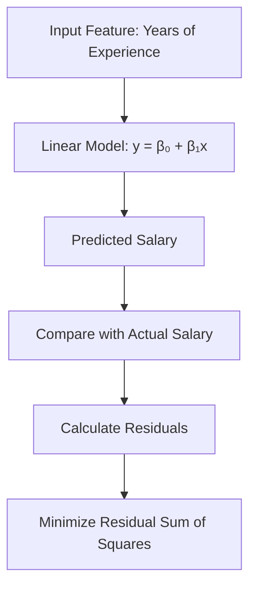

# Introduction to Linear Regression

Linear Regression is a fundamental supervised machine learning technique used to predict continuous outcomes by modeling the relationship between a dependent variable and one or more independent variables.

---

## Key Concepts

- **Dependent Variable (Target)**: The outcome we want to predict
- **Independent Variables (Features)**: Inputs used for prediction
- **Regression Line**: Line of best fit through the data
- **Residuals**: Differences between predicted and actual values

---

## Types of Linear Regression

1. **Simple Linear Regression**  
   - Involves one predictor  
   - Example: Predicting salary based on years of experience

2. **Multiple Linear Regression**  
   - Involves two or more predictors  
   - Example: Predicting house price based on size, location, and number of bedrooms

---

## Mathematical Formulation

$$
y = \beta_0 + \beta_1 x + \varepsilon
$$

Where:
- (y): Predicted output
- (x): Input feature
- (β₀): Intercept
- (β₁): Slope
- (ε): Error term

---

## Real-World Applications

| Domain     | Use Case                                          |
|------------|---------------------------------------------------|
| Business   | Forecasting sales based on advertising budget     |
| Finance    | Predicting stock returns based on economic indicators |
| Healthcare | Estimating blood pressure using patient metrics   |
| HR         | Predicting salaries based on job experience       |

---

## Assumptions of Linear Regression

1. **Linearity**: Linear relationship between input and output  
2. **Independence**: Observations are independent  
3. **Homoscedasticity**: Constant variance of residuals  
4. **Normality**: Residuals are normally distributed  
5. **No Multicollinearity**: Inputs are not highly correlated

---

## Mermaid Diagram – Conceptual Flow of Simple Linear Regression

